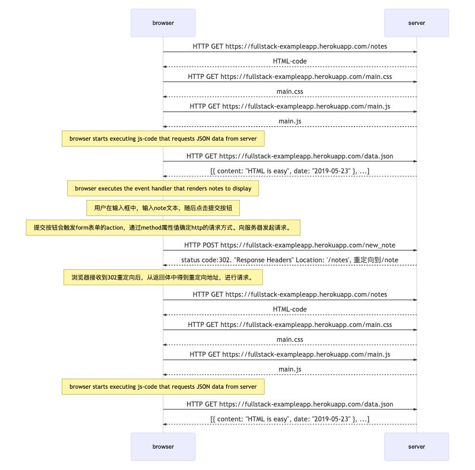
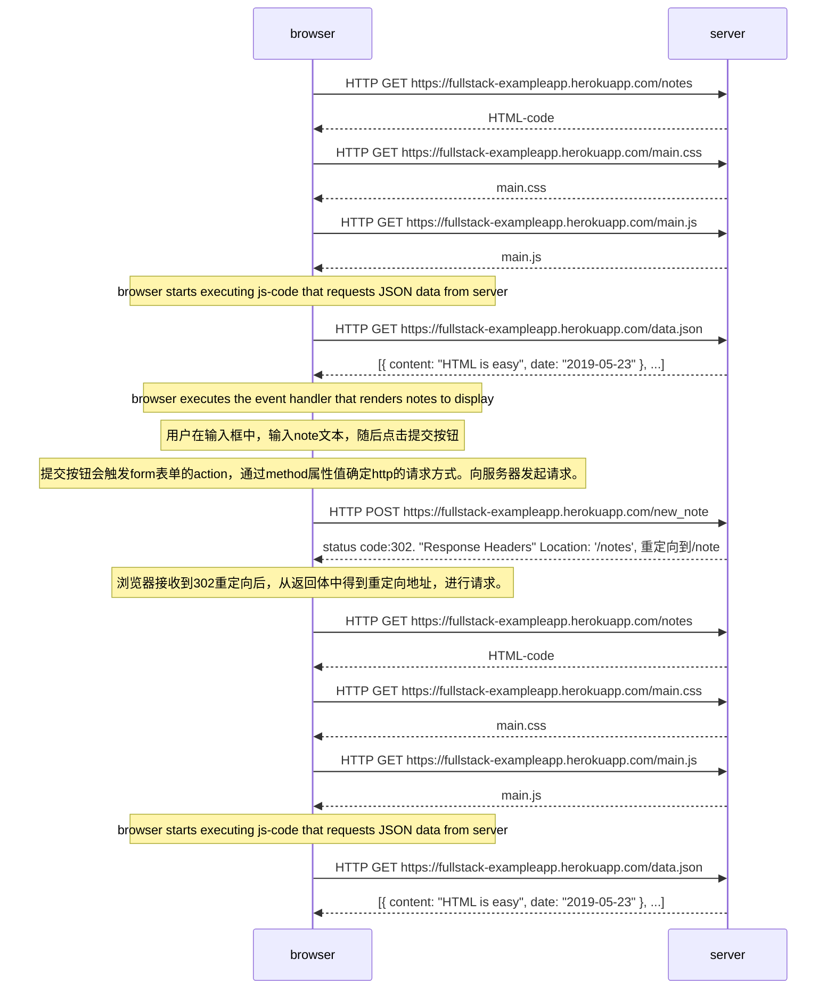

```mermaid
sequenceDiagram
    browser->>server: HTTP GET https://fullstack-exampleapp.herokuapp.com/notes
    server-->>browser: HTML-code
    browser->>server: HTTP GET https://fullstack-exampleapp.herokuapp.com/main.css
    server-->>browser: main.css
    browser->>server: HTTP GET https://fullstack-exampleapp.herokuapp.com/main.js
    server-->>browser: main.js

    Note over browser: browser starts executing js-code that requests JSON data from server

    browser->>server: HTTP GET https://fullstack-exampleapp.herokuapp.com/data.json
    server-->>browser: [{ content: "HTML is easy", date: "2019-05-23" }, ...]

    Note over browser: browser executes the event handler that renders notes to display

    Note over browser: 用户在输入框中，输入note文本，随后点击提交按钮
    Note over browser: 提交按钮会触发form表单的action，通过method属性值确定http的请求方式。向服务器发起请求。
    browser->>server: HTTP POST https://fullstack-exampleapp.herokuapp.com/new_note
    server-->>browser: status code:302. "Response Headers" Location: '/notes', 重定向到/note

    Note over browser: 浏览器接收到302重定向后，从返回体中得到重定向地址，进行请求。

    browser->>server: HTTP GET https://fullstack-exampleapp.herokuapp.com/notes
    server-->>browser: HTML-code
    browser->>server: HTTP GET https://fullstack-exampleapp.herokuapp.com/main.css
    server-->>browser: main.css
    browser->>server: HTTP GET https://fullstack-exampleapp.herokuapp.com/main.js
    server-->>browser: main.js

    Note over browser: browser starts executing js-code that requests JSON data from server

    browser->>server: HTTP GET https://fullstack-exampleapp.herokuapp.com/data.json
    server-->>browser: [{ content: "HTML is easy", date: "2019-05-23" }, ...]
```
