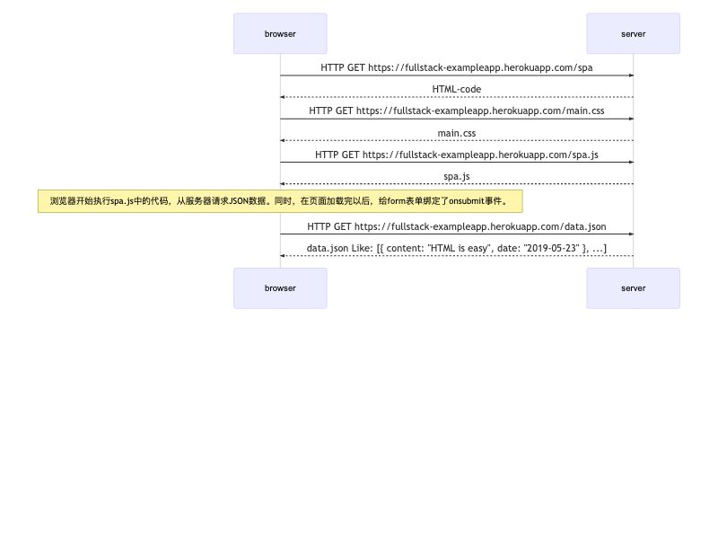
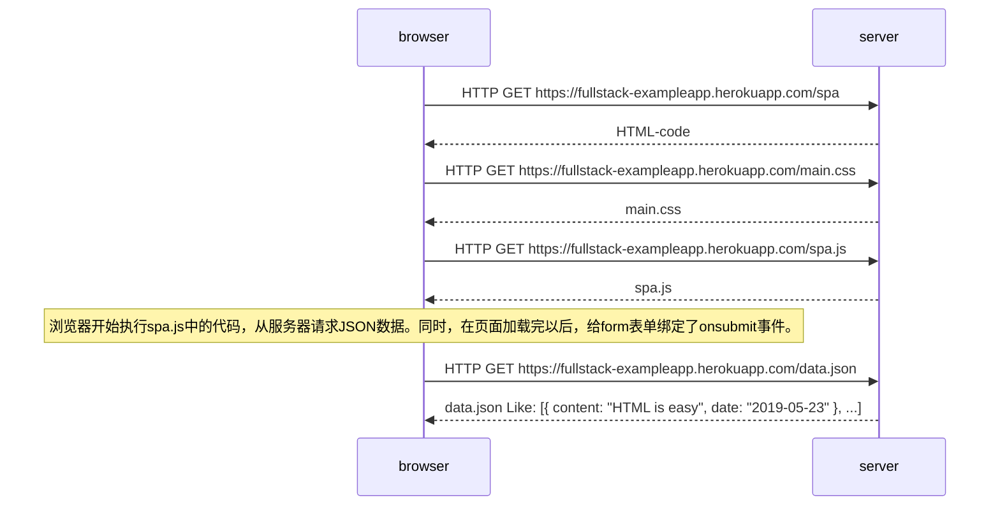

```mermaid
sequenceDiagram
    browser->>server: HTTP GET https://fullstack-exampleapp.herokuapp.com/spa
    server-->>browser: HTML-code
    browser->>server: HTTP GET https://fullstack-exampleapp.herokuapp.com/main.css
    server-->>browser: main.css
    browser->>server: HTTP GET https://fullstack-exampleapp.herokuapp.com/spa.js
    server-->>browser: spa.js
    Note over browser: 浏览器开始执行spa.js中的代码，从服务器请求JSON数据。同时，在页面加载完以后，给form表单绑定了onsubmit事件。
    browser->>server: HTTP GET https://fullstack-exampleapp.herokuapp.com/data.json
    server-->>browser: data.json Like: [{ content: "HTML is easy", date: "2019-05-23" }, ...]

```
