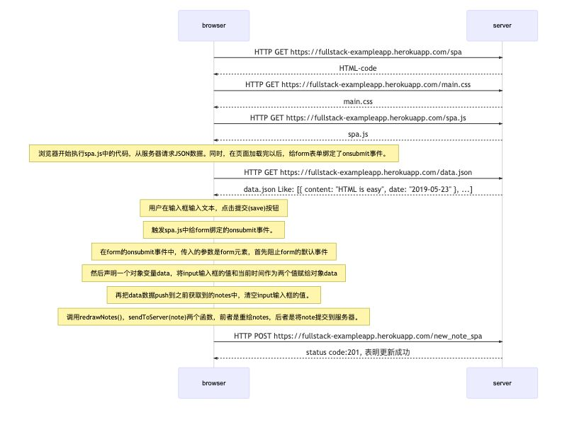
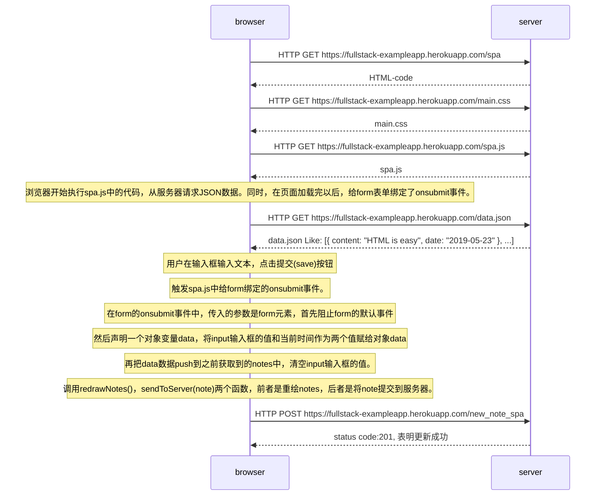

```mermaid
sequenceDiagram
    browser->>server: HTTP GET https://fullstack-exampleapp.herokuapp.com/spa
    server-->>browser: HTML-code
    browser->>server: HTTP GET https://fullstack-exampleapp.herokuapp.com/main.css
    server-->>browser: main.css
    browser->>server: HTTP GET https://fullstack-exampleapp.herokuapp.com/spa.js
    server-->>browser: spa.js

    Note over browser: 浏览器开始执行spa.js中的代码，从服务器请求JSON数据。同时，在页面加载完以后，给form表单绑定了onsubmit事件。

    browser->>server: HTTP GET https://fullstack-exampleapp.herokuapp.com/data.json
    server-->>browser: data.json Like: [{ content: "HTML is easy", date: "2019-05-23" }, ...]

    Note over browser: 用户在输入框输入文本，点击提交(save)按钮
    Note over browser: 触发spa.js中给form绑定的onsubmit事件。
    Note over browser: 在form的onsubmit事件中，传入的参数是form元素，首先阻止form的默认事件
    Note over browser: 然后声明一个对象变量data，将input输入框的值和当前时间作为两个值赋给对象data
    Note over browser: 再把data数据push到之前获取到的notes中，清空input输入框的值。
    Note over browser: 调用redrawNotes()，sendToServer(note)两个函数，前者是重绘notes，后者是将note提交到服务器。

    browser->>server: HTTP POST https://fullstack-exampleapp.herokuapp.com/new_note_spa
    server-->>browser: status code:201, 表明更新成功
```
